# SitecoreAI Advanced Workbox

Modern workflow management for SitecoreAI. Runs as a Sitecore Marketplace app and presents the configured workflows as a drag-and-drop Kanban board with bulk transition actions and a site filter.

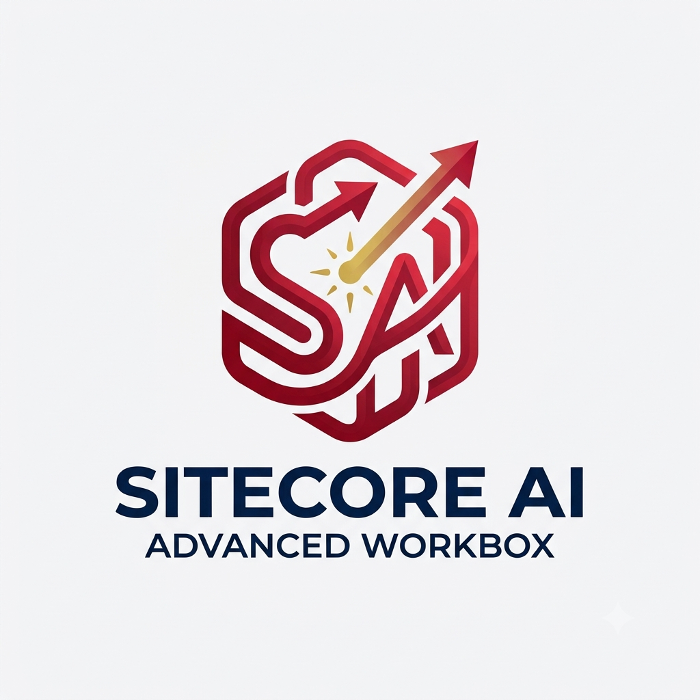

## Features

- **Kanban board** — list all workflows and their items in a Sitecore tenant

  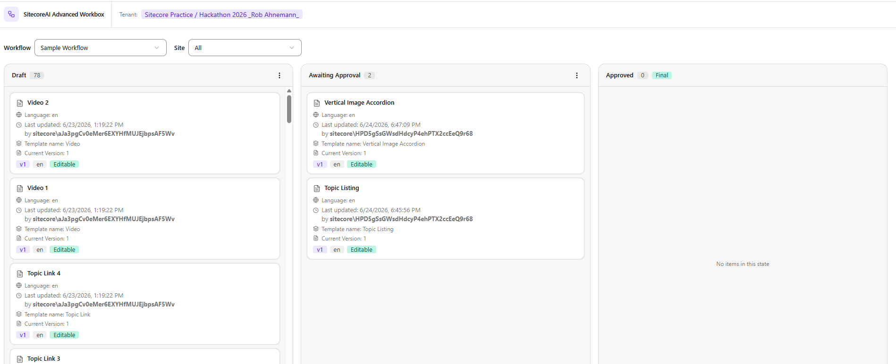

- **Site filter** — narrow items down by site within a tenant

  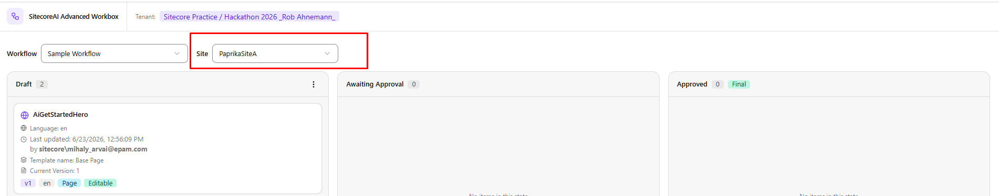

- **Drag-and-drop transitions** — move items between states, respecting the configured next allowed states

  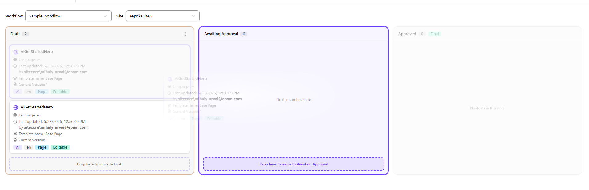

- **Comments** — leave a comment when performing a state transition

  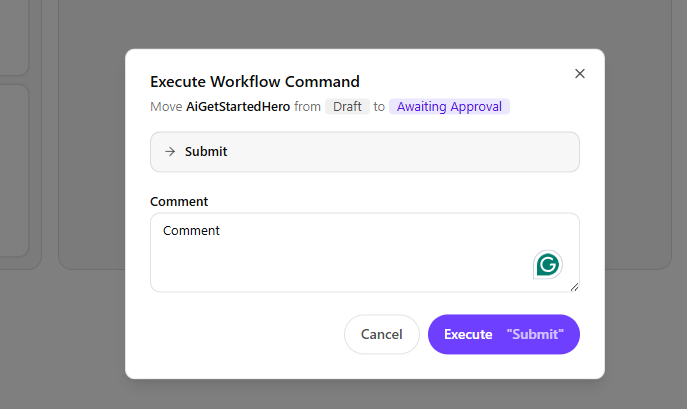

- **Item detail drawer** — quick view for path, language, workflow history, access rights, and publishing status

  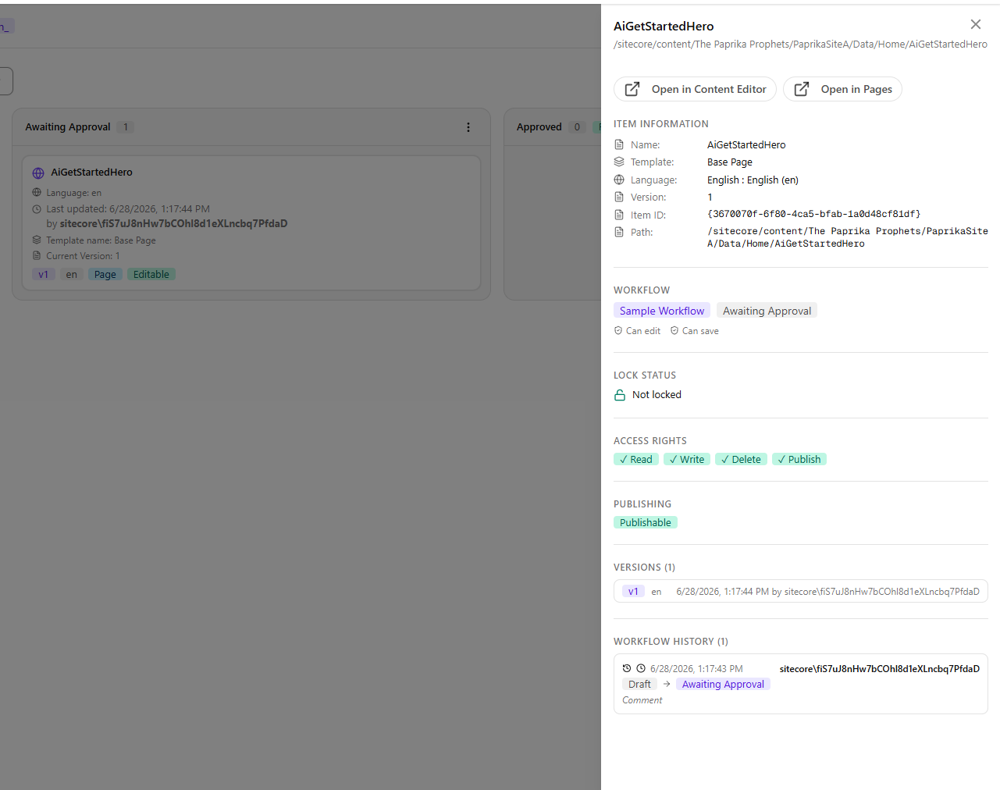

- **Open in Page Builder** — jump directly into Pages from the detail drawer

  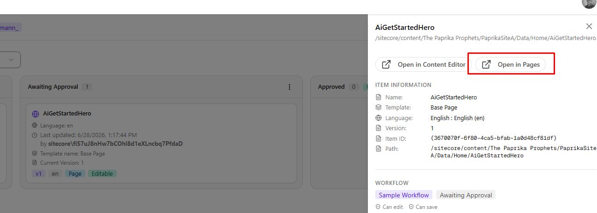

- **Perform batch workflow actions** — perform batch actions 
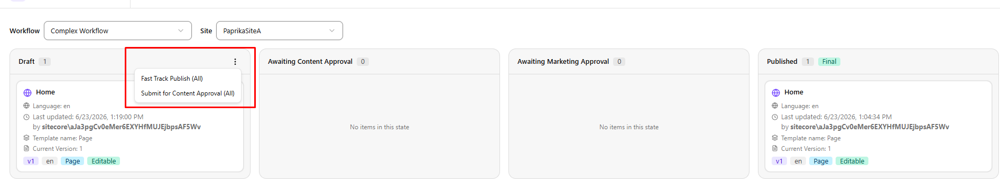  

## Prerequisites

- Node.js 20+
- A SitecoreAI tenant with at least one workflow configured
- The app registered in Sitecore Marketplace with `xmc.authoring.graphql` access

## Getting started

You can either run it locally or host it yourself, or use the `https://sitecoreai-advanced-workbox.vercel.app/`. link and configure it directly in the Sitecore Cloud Portal.

```bash
npm install
npm run dev
```

### Configuring Marketplace

1. Open **App Studio** in the Cloud Portal and click the **Create App** button.

   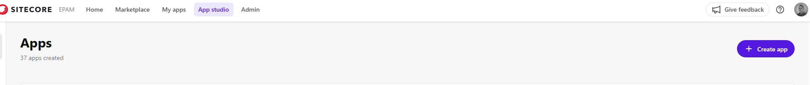

2. Select **Custom** application type and name it.

   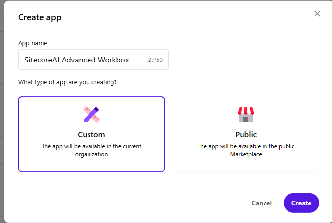

3. Click the **Configure App** button to configure your application.

4. Configure the following extension points:
   - **Standalone** — Route: `/`
   - **Full Screen** — Route: `/workflows`

   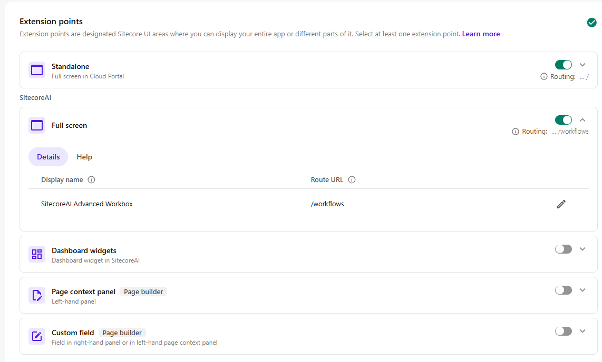

5. Grant access to **SitecoreAI APIs**.

   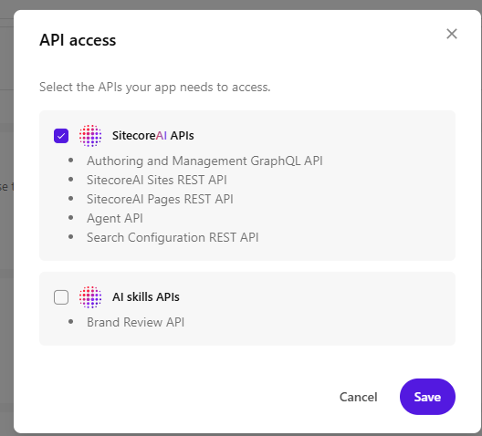

6. Set the **Deployment URL** to either `http://localhost:3000` or `https://sitecoreai-advanced-workbox.vercel.app/`.

   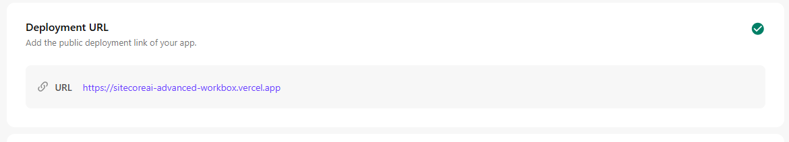

7. Upload the app logo and click the **Active** button in the top-right corner.

8. Go to the **My Apps** section in the Cloud Portal, click **Install**, and install the app in the tenants where you want to use it.

   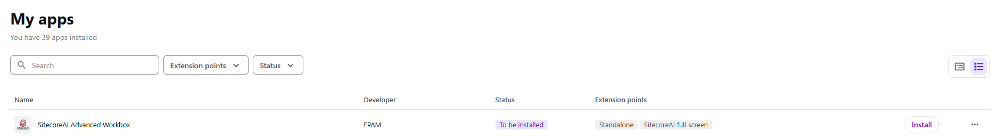

9. The app will appear on the Cloud Portal homepage (as a Standalone app) and on the Sites page as a Full Screen application.

## Scripts

- `npm run dev` — Next.js dev server
- `npm run build` — production build
- `npm run start` — run the production build
- `npm run lint` — ESLint

## Project structure

- `app/` — Next.js App Router pages (`/` tenant picker, `/workflows` board)
- `components/board/` — Kanban board, columns, cards, DnD context, command and progress dialogs
- `components/providers/` — Marketplace SDK and tenant context providers
- `components/ui/` — shadcn-style primitives
- `lib/api/workflow-service.ts` — GraphQL client wrapping `xmc.authoring.graphql`
- `lib/api/graphql-types.ts` — GraphQL response types